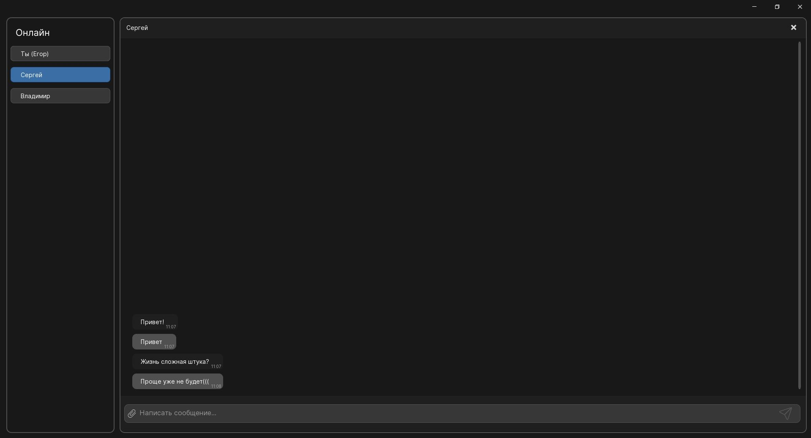

reg add HKCU\Console /v VirtualTerminalLevel /t REG_DWORD /d 1 /f

Это настраивает терминал для цветного вывода

Клиент и сервер можно запускать с аргументами командной строки: Server.exe <ip> <port> / Client.exe <ip> <port>. 
Если аргументы не переданы, будут использоваться значения по умолчанию — 127.0.0.1:5555

<picture>
 <source media="(prefers-color-scheme: dark)" srcset="https://github.com/GiperB0la/GiperbolaBook/blob/main/Screen.png">
 <source media="(prefers-color-scheme: light)" srcset="YOUR-LIGHTMODE-IMAGE">
 
</picture>
